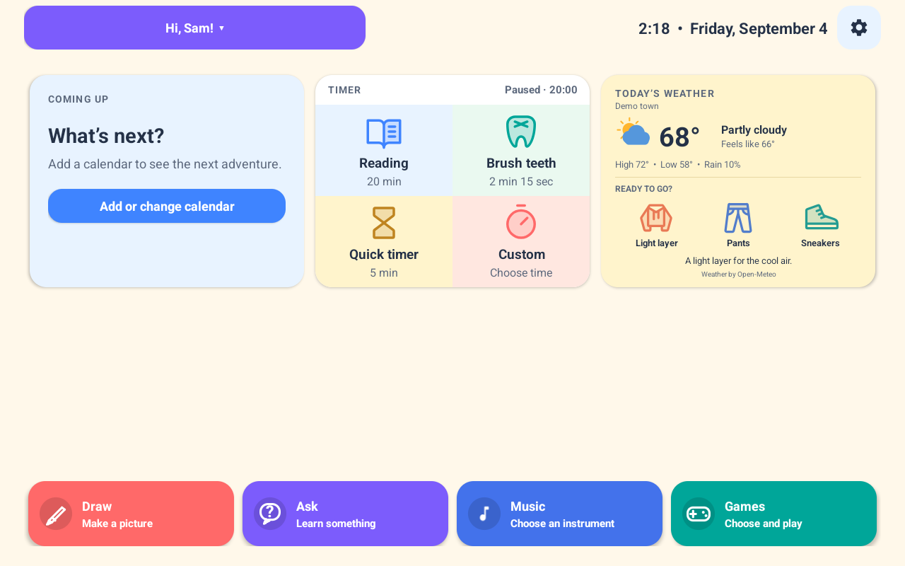
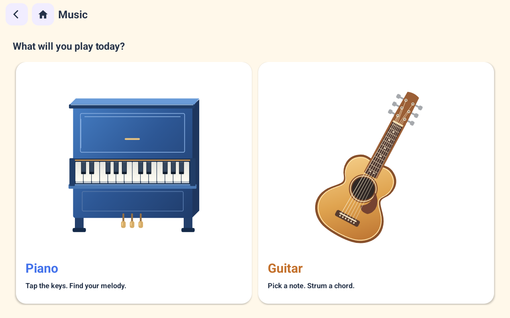
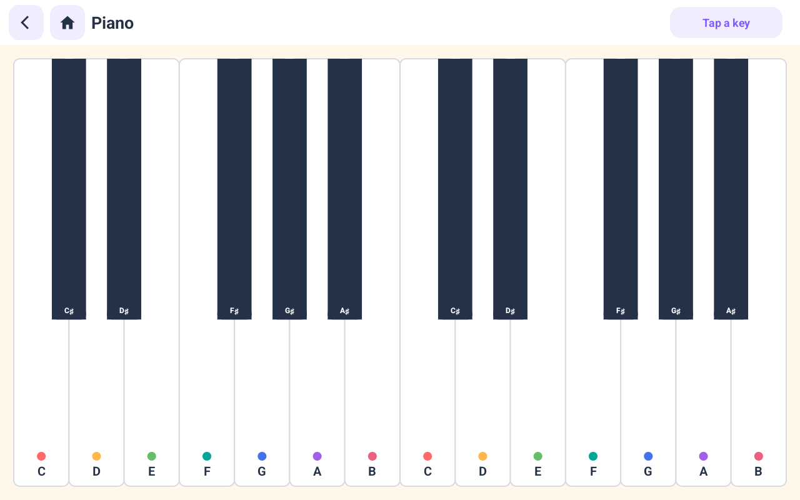
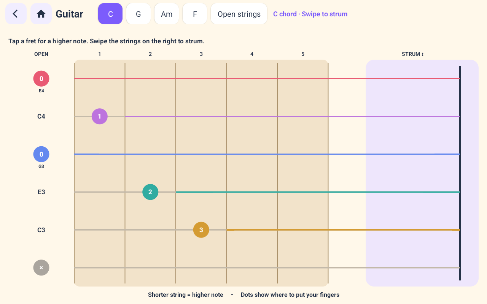
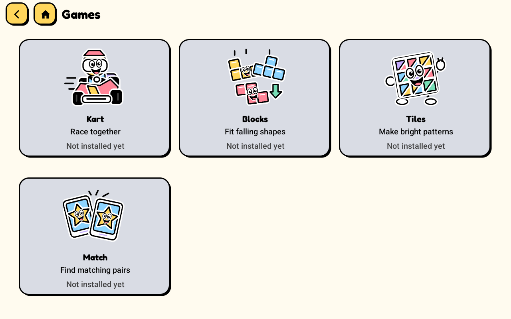
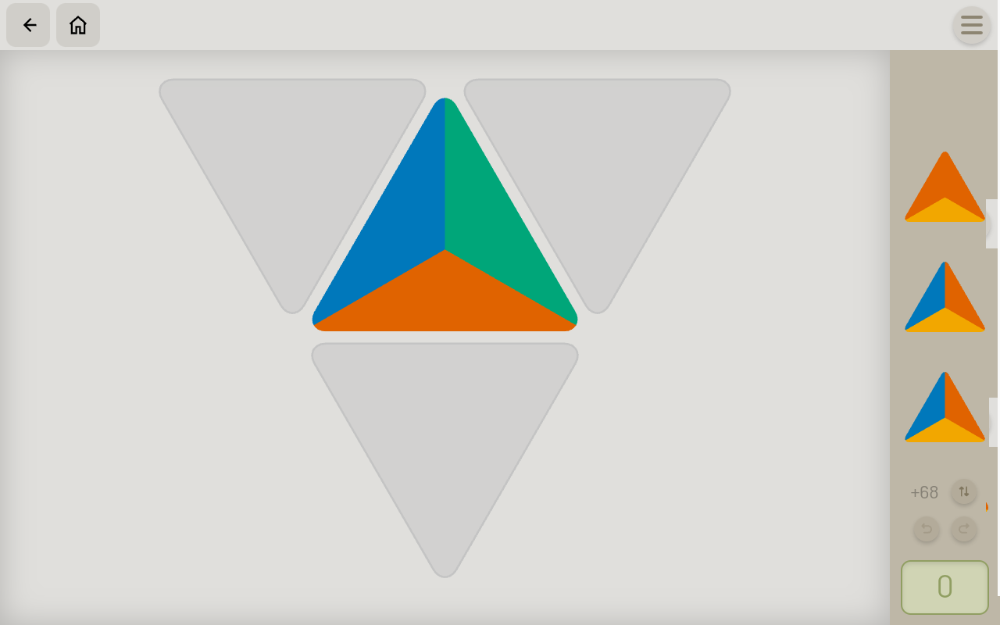
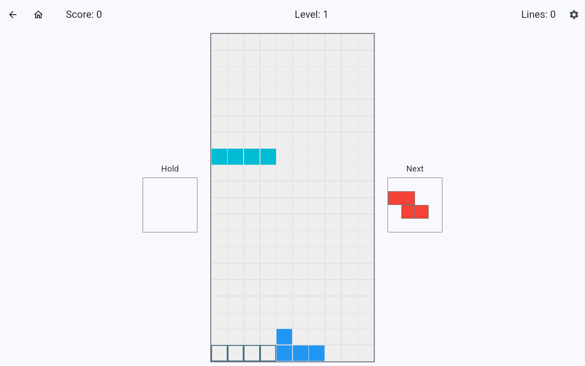
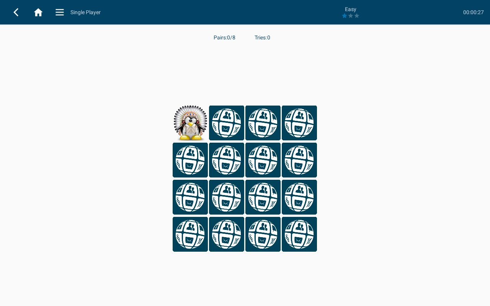
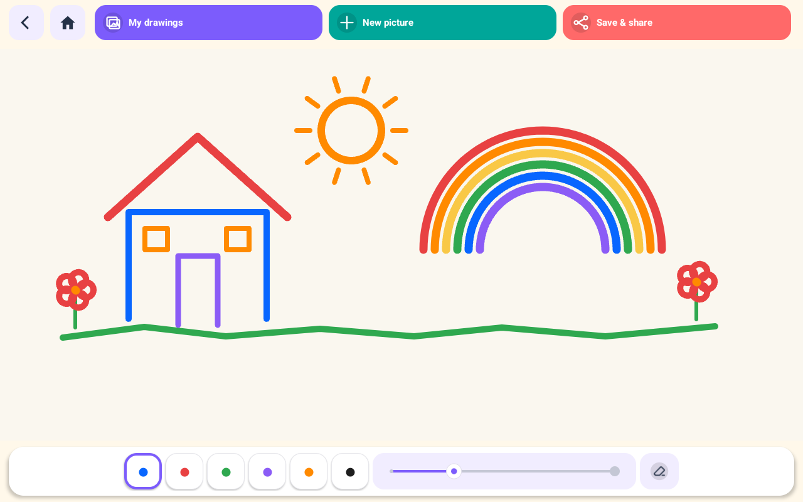

# FamilyHome

**A new home for your Meta Portal.**

FamilyHome turns a first-generation Meta Portal into a family activity station.
Children can draw, play piano and guitar, use timers, and open games from one home screen.
Each child has a profile with separate drawings and settings.
The weather widget shows the forecast and suggests clothes for the day.

[Setup guide](docs/INSTALL.md) · [Screenshots and demo](screenshots/README.md) · [Development](docs/DEVELOPMENT.md) · [Family authentication plan](docs/MULTI-FAMILY.md)

*Development preview: version 0.13.0, 1280 × 800 Android emulator, with sample data, including an example weather report. See the [capture details](screenshots/README.md).*

## Music: piano and guitar

| Piano | Guitar |
| --- | --- |
|  |  |
| Play notes and chords with multiple fingers. | Touch the frets, choose a chord, and strum six strings. |

Both instruments generate sound on the device and work without a service connection.

## Games: puzzles, patterns, and matching pairs

| Tiles | Blocks |
| --- | --- |
|  |  |
| Connect colors to make patterns. | Move and rotate shapes to fill rows. |

| Match | Drawing |
| --- | --- |
|  |  |
| Turn over cards to find matching pairs. | Choose colors and brushes. Save pictures for each child. |

Games use separately installed APKs with their own licenses.
These captures show the Portal adaptations of Tessel, Block Drop, and Privacy Friendly Memo Game.
The library also has entries for Kart and Freedoom.
See the [game guide](android/GAMES.md) and [third-party notices](THIRD_PARTY.md).

## Weather and daily routines

The home screen combines timers, the next calendar event, and the weather widget.
Weather includes the temperature, expected rain, and clothing suggestions.
Enter a ZIP code or city in Settings to show the widget.

Each child has a turn and a profile with separate drawings and timer settings.
[See the profile selector](screenshots/profiles.png).

[Watch the short, silent demo](screenshots/familyhome-demo.mp4).

## What works today

| Feature | Connection |
| --- | --- |
| Child profiles, local drawings, brush choices, and timers | Works on the device without a service connection. |
| Piano and guitar | Generates sound on the device without a service connection. |
| Game library | Opens separately installed games. Each game has its own network requirements. |
| Next calendar event | Requires the companion service and a configured ICS feed. |
| Weather | Requires the companion service and a configured ZIP code or city. |
| Ask by text or recorded voice | Requires the companion service and its LLM Proxy connection. |
| Drawing share links | Requires the companion service. Recipients can open a link in a browser. |

The game library contains entries for Freedoom, Kart, Blocks, Tiles, and Match.
Game installation is separate from FamilyHome installation.
The [game guide](android/GAMES.md) records the reviewed builds.

## Current status

FamilyHome is a developer preview for first-generation Meta Portal hardware with Android 9 (API 28).
The [setup guide](docs/INSTALL.md) describes the current build and ADB installation process.
The images above show an emulator build. They do not establish hardware acceptance for that build.

The current service uses one shared installation credential.
Parent sign-in, individual device credentials, and family isolation are planned in **P002**.
The first hosted pilot will serve invited households after that work passes acceptance.
See the [multi-family design](docs/MULTI-FAMILY.md) for the technical scope.

Child profiles currently organize local data. Profile selection and Settings have no parent authentication.
LLM credentials stay on the service host. The APK contains the FamilyHome installation credential.
A drawing share link grants access to its image to anyone who has the link.

## Keep the choice of home screen

FamilyHome uses Android's home-app selection.
The original Meta launcher remains installed.
The [setup guide](docs/INSTALL.md#restore-the-meta-home-screen) includes the command to restore it.

## Build and contribute

The Android app uses native Java. The companion service uses Go.
The [development guide](docs/DEVELOPMENT.md) contains build requirements, checks, and service operations.
The [Android guide](android/README.md) and [service guide](service/README.md) describe each component.

For a bug report, include the Portal model, Android version, FamilyHome version, and steps to reproduce the problem.
Use sample data in screenshots and logs.

## License

FamilyHome's original application code uses the [MIT License](LICENSE).
Third-party code, icons, and game adaptations retain their own licenses.
See [third-party notices](THIRD_PARTY.md).
