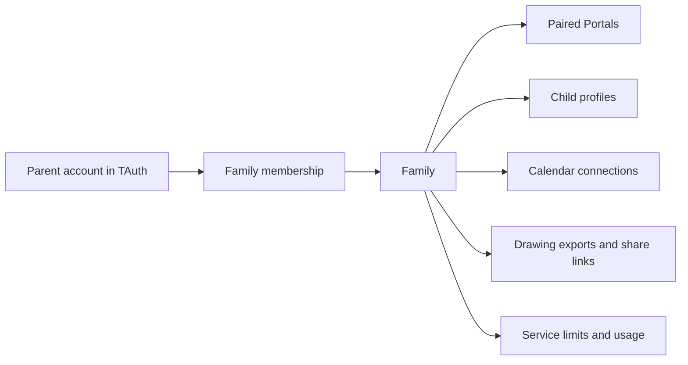

# Family authentication and shared service design

Status: Overview of the technical proposal in P002. Application changes require a separate request.

P002 contains the detailed schema, HTTP resources, pairing states, migration sequence, open decisions, and proposed acceptance scenarios.

## Confirmed direction

The first pilot uses an MPR-hosted service for invited households.
The selected project license is MIT.
Public announcements follow the authentication and family-isolation work.
P001 remains the separate Google Calendar plan.
Google is the only parent sign-in provider for the first implementation.
After sign-in, the parent connects existing Google calendars or creates new calendars for the family and each child.

## Current implementation

The backend has one shared device credential, supplied through `FAMILYHOME_DEVICE_TOKEN`.
Each APK contains that credential.
Successful authentication proves possession of the shared credential. It does not identify a particular Portal or family.

| Area | Current source | Consequence |
| --- | --- | --- |
| Authentication | `service/main.go`: `authenticate` | Every accepted device has the same access. |
| Child profiles | `android/app/src/main/java/com/mprlab/portal/ProfileStore.java` | Profile records exist only on the Portal. |
| Ask | `service/main.go`: `completeAsk` | The caller supplies the child name and profile ID. The backend does not check ownership. |
| Calendars | `service/main.go`: `nextCalendarEvent` | The caller supplies the HTTP or HTTPS URL for the backend to fetch. |
| Drawings | `service/main.go`: `saveDrawing`, `getDrawing` | Shared images have one storage directory and public capability links. Family ownership has no record. |
| Parent settings | `android/app/src/main/java/com/mprlab/portal/SettingsActivity.java` | The settings screen has no parent authentication. |
| Operations | `.mprlab/deploy/resources.yml` | One service and retained volume exist. Family usage limits and device revocation do not exist. |

The service can accept requests from multiple devices that possess the same credential.
It cannot distinguish those devices as separate households.
Random drawing identifiers reduce guessing. They do not establish family ownership, deletion authority, or revocation.

## Recommended ownership model

One FamilyHome backend serves all pilot families.
One TAuth application tenant serves FamilyHome parent accounts.
FamilyHome stores family membership separately from the TAuth tenant.

| Record | Purpose | Relationship |
| --- | --- | --- |
| Parent identity | Reference to the stable TAuth account ID | One parent can have membership in multiple families. |
| Family | Data and usage boundary | A family has parents, children, devices, and service settings. |
| Membership | Parent access within a family | Each membership has a role and active state. |
| Device | One paired Portal | Each device belongs to one family. A family can have multiple devices. |
| Child profile | Child identity within the family | Each profile belongs to one family. |
| Calendar connection | Parent-approved calendar access | The connection belongs to a family and has explicit child assignments. |
| Drawing export | Image uploaded for sharing | The export records its family, child, and source device. |
| Share link | Explicit recipient access | The link refers to one drawing export and has a revocation state. |
| Usage record | Service consumption | Each record identifies the family, device, operation, and request. |

Parent authentication establishes the adult identity.
Device authentication establishes the Portal identity and its family.
Family membership and resource ownership determine access after authentication.
The child selector identifies the active profile on a shared device. It does not prove which child holds the device.

The pilot can use owner and parent roles.
The owner controls membership and family deletion.
Both roles can manage children, devices, and calendar connections.
Role details require confirmation before implementation.

## Parent sign-in

TAuth and `mpr-ui` own browser sign-in, session restoration, refresh, and logout.
The FamilyHome authentication configuration permits Google only.
FamilyHome supplies `/config-ui.yaml` and responds to the documented authentication lifecycle.
The backend validates the TAuth session with the official session validator.
It also checks the configured application tenant and current family membership.

Use the issuer, application tenant, and stable TAuth account ID as the identity reference.
Email addresses and child names are display or invitation data, not record identifiers.
TAuth account management supplies stable account IDs independently of Google email addresses.
The released TAuth and `mpr-ui` contracts require verification during implementation.

A FamilyHome invitation controls admission to the hosted pilot.
An authenticated account without an accepted invitation has no family membership.
Invitation acceptance must verify the intended account or verified email, expiration, and single use.

The parent website uses GitHub Pages.
The API remains on its separate hostname.
The website hostname, authentication profile, cookie names, and exact CORS policy remain open deployment inputs.
Browser mutations require explicit CSRF protection and permitted-origin checks.

## Calendar setup after parent sign-in

P001 defines the calendar setup contract after Google parent sign-in.
P002 supplies the parent identity, family membership, and child profile records.
The existing authentication dependency is TAuth. Confirmation that the requested name `TOS` means TAuth remains open in P001.

The proposed parent onboarding offers a choice between an existing family calendar and a new family calendar.
Setup for each child profile offers the same choice for that child's personal calendar.
The child-profile dialog can start setup. The authenticated parent completes Google authorization on a phone or computer.
Parent settings provide later access to the same flow.
Exact screen placement and the option to defer setup remain open decisions in P001.

Google sign-in establishes parent identity. Separate Google Calendar consent grants the required calendar access within the same flow.
The backend records the selected Google calendar IDs and their family or child assignments.
Google Calendar remains the authoritative source for events.
P001 defines both connection and creation for the first implementation.

## Portal pairing

The recommended setup has these steps:

1. Install the same signed APK on each Portal.
2. Start a pairing request on the Portal.
3. Scan its QR code with the parent phone.
4. Complete parent sign-in through TAuth and `mpr-ui`.
5. Select a family with an active parent membership.
6. Confirm the matching code and device on both screens.
7. Activate the device credential after parent approval and Portal confirmation.
8. Retrieve the family profiles through the paired device connection.

The pairing code has a short lifetime and one permitted use.
Pairing approval requires parent authentication and membership in the selected family.
The Portal creates and encrypts a random candidate credential before its first pairing request.
It supplies the credential digest during request creation.
The candidate credential authenticates only its own pairing status and confirmation operations before activation.
The displayed code alone cannot activate the device credential.
Creation, code attempts, and polling require limits.
Approval and device activation require atomic state transitions with defined retry behavior.
The same candidate credential identifies the device after activation.
A repeated confirmation returns the same device identity without raw credential delivery from the server.
P002 records the initial response-loss recovery decision separately from activation retries.

FamilyHome owns device enrollment and device credentials. TAuth continues to own parent authentication.
The server stores a digest of each random device credential, its device reference, and its lifecycle state.
The Android app protects the credential with encryption whose key is in Android Keystore.
Every protected device request checks the current device state.
Parent removal of one device stops its future service access without changing other device credentials.

This is a proposed application pairing protocol.
The TAuth source inspected on 2026-09-04 has no device-code grant implementation.
An OAuth device grant would require a separately owned TAuth extension.
[RFC 8628](https://www.rfc-editor.org/rfc/rfc8628.html) provides a reference for code confirmation, expiration, polling, and attack limits.
[Android Keystore](https://developer.android.com/privacy-and-security/keystore) provides the key-storage contract.

## Family isolation

The backend creates a verified request context after parent or device authentication.
Device requests get their family from the stored device record.
Parent requests get access through current family membership.
A supplied family ID selects a resource. It never grants access by itself.

Every child, calendar, drawing, share-management, and usage operation checks this context.
Database queries include the family boundary.
Database constraints prevent a child or drawing from referencing a device in another family.
Membership changes preserve at least one active owner per active family.
The backend uses stored child data for Ask after it checks the requested profile.
It rejects a profile from another family before any provider request.

The pilot needs persistent records and transactions.
SQLite on the existing retained volume is a reasonable proposal for the current single-instance service.
The implementation must enable foreign keys and define transactions, schema migrations, backups, and restore checks.
Horizontal service replication requires a separate database deployment decision.

The endpoint groups remain distinct:

| Caller | Permitted work |
| --- | --- |
| Authenticated parent | Family membership, device approval, child settings, calendar connections, share revocation, and family deletion |
| Paired device | Its family profiles, permitted calendars, weather, Ask, and drawing exports |
| Unpaired device | Limited pairing operations |
| Share recipient | Read the specific image while the share link remains active |

## Changes to current features

Calendar requests use a stored calendar-connection ID after the ownership change.
Parents control the connection and child assignments.
For the current ICS contract, the server validates destinations and redirects and blocks access to internal network addresses.
P001 later replaces ICS with Google Calendar access through the same family ownership model.
Google sign-in and permission to read Google calendars remain separate operations.

Drawing export records contain family ownership.
Share links have explicit creation, revocation, and deletion behavior.
Storage accounting applies to the owning family.
Public share links intentionally permit recipient access to one image.

Ask has a family usage budget and a device request limit.
The backend reserves capacity before a provider request and records the result after completion.
The existing shared LLM Proxy client can remain server-side.
The family accounting boundary belongs in FamilyHome.
Pilot limits, provider costs, and usage retention require explicit values before invitations begin.

Parent approval controls connected features and family settings.
The Portal displays settings that match its device authority.
Parent account sessions and Google credentials remain off the shared Portal.

## Local data and migration

Drawing, piano, and timers remain available without a service connection.
The initial scope includes family profile metadata across paired devices.
It does not include synchronization of drawing documents or running timers between devices.

Existing profiles and drawings require a bounded import into the first family.
Parent approval establishes ownership of the existing Portal and its profiles.
The import preserves local profile IDs or records an explicit mapping that preserves each drawing association.
An import receipt prevents duplicate profile creation after retries.
Shared exports need an explicit ownership migration because their filenames do not prove ownership.

The client and backend then move together to device authentication.
The old shared credential and build-time credential input are removed.
The migration bridge is removed after verified completion.

Remote revocation stops service access. It cannot erase data from a disconnected Portal.
Device transfer requires a separate local removal procedure before another family pairs the device.
Offline behavior after revocation and local removal behavior require confirmation.

## Implementation order and acceptance

| Stage | Deliverable | Required evidence |
| --- | --- | --- |
| 1 | Family records, parent sign-in, memberships, and pilot invitations | Two real parent sessions resolve to separate families. An uninvited account receives no family access. |
| 2 | Pairing, unique device credentials, and parent device controls | Two Portals pair to different families. Expired and repeated codes fail. Revocation affects one device only. |
| 3 | Profile, calendar, drawing, and usage ownership | Requests with another family's IDs fail before reads, writes, or provider calls. |
| 4 | Existing-data import and shared-token removal | Profiles and drawings survive the update. The old shared credential fails. |
| 5 | Pilot qualification and release | Restart, backup restore, offline use, parent removal, share revocation, and installation pass on real devices. |

Integration tests must use the real HTTP service and persistent store.
They must cover two families, two parents, two devices, and swapped resource identifiers.
They must also cover simultaneous pairing approval, repeated import requests, and device revocation during active use.
Source tests, hosted browser authentication, backend deployment, and Portal acceptance remain separate results.

## Decisions before implementation

- Confirm this proposed family and device ownership model.
- Confirm the owner and parent roles.
- Verify the released TAuth and `mpr-ui` contract for Google-only parent sign-in.
- Confirm the parent website hostname and authentication profile.
- Select the database for the pilot.
- Define device credential expiration and renewal.
- Define pilot invitations, usage limits, retention, and deletion.
- Confirm local-data treatment during device removal and transfer.
- Confirm the family ownership model with the calendar design in P001.

README updates, screenshots, and local launch drafts can proceed during planning.
Public announcements follow the family-isolation acceptance gate and explicit publication approval.

## Review evidence

The source review date is 2026-09-04.
This review changed documentation only.
P002 defines the current document-validation procedure and proposed implementation acceptance.
