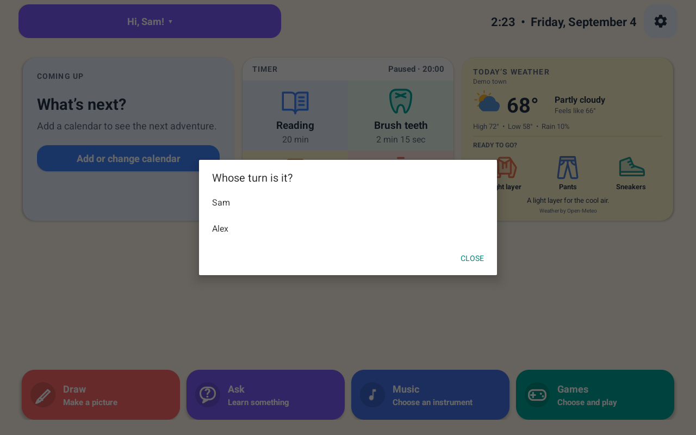

# FamilyHome screenshots and demo

These images show FamilyHome and its separately installed game adaptations with sample data.
The app rendered the sample drawing from a local drawing document.
The screenshots have no added controls or image edits.

## Capture details

| Field | Value |
| --- | --- |
| Capture date | 2026-09-04 |
| App version | 0.13.0, version code 19 |
| Runtime | Dedicated Android emulator, API 37 |
| Screen | 1280 × 800, landscape, density 160 |
| Source | Working-directory snapshot with Music, Guitar, and the combined toolbar |
| Profiles | Sam and Alex, both sample profiles |
| Drawing | Sample house, sun, rainbow, and flowers |
| Weather | Example report for Demo town, loaded into the local cache |
| Other connected features | Unconfigured, with a reserved invalid service address |
| Installed games | Kart, Blocks, Tiles, and Match |
| Video | Silent screen recording with touch indicators |

The preview APK uses development configuration and a temporary test signing key.
The screenshot set does not contain production credentials, real family names, calendar events, or household locations.
The weather values are sample data, not a live forecast.
The app renders its normal weather card, including its provider label and clothing suggestions.

The target Portal runs Android 9 (API 28).
These emulator captures demonstrate the interface. They do not prove physical Portal behavior or audio quality.
The source snapshot predates any later concurrent application edits.
The [capture manifest](capture-manifest.json) records the source and asset hashes.

## Home


## Drawing


## Music


## Piano


## Guitar


## Games


Freedoom is not installed in this emulator.
The library displays its installation state.

## Tiles


## Blocks


## Match


The games retain their [third-party licenses](../THIRD_PARTY.md).

## Profiles



## Short demo

[Open the silent app walkthrough](familyhome-demo.mp4).

The recording shows Home with weather, the game library, Tiles, Blocks, Music, Piano, Guitar, and Drawing.

## Refresh procedure

1. Build the selected source with development configuration and a dedicated test signing key.
2. Install the APK on a dedicated emulator with the declared screen dimensions.
3. Create sample profiles and a sample drawing.
4. Configure example weather in the local cache with the current timestamp.
5. Install the selected game APKs.
6. Open each screen and wait for its controls to finish drawing.
7. Capture each screen with ADB:

   ```sh
   adb -s <preview-emulator> exec-out screencap -p > screenshots/home.png
   ```

8. Capture the walkthrough with `adb shell screenrecord` on that emulator.
9. Review every image for clipped controls, readable labels, and sample data.
10. Review the video for complete transitions and readable screens.
11. Update the capture manifest and version statements.

Use the accepted release build for the public launch images.
Record physical-device acceptance separately.
